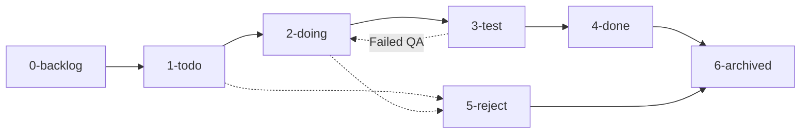

# 📋 Task & Kanban Manager Skill

This skill defines the operational procedures for managing task cards, plans, and roadmap execution across project lifecycle stages.

---

## 🗂️ Workflow Lifecycle Stages

| Stage Folder | ความหมาย (Meaning) | เงื่อนไขการย้ายเข้า (Entry Criteria) |
| :--- | :--- | :--- |
| **`0-backlog`** | แหล่งเก็บแผนงานและฟีเจอร์ทั้งหมด | แผนงานใหม่ที่ยังไม่เริ่มดำเนินการในรอบ/เฟสปัจจุบัน |
| **`1-todo`** | สิ่งที่เราจะต้องทำในเฟสนี้ | งานที่คัดเลือกมาจาก Backlog เพื่อเตรียมทำในรอบปัจจุบัน (Dependencies พร้อม) |
| **`2-doing`** | สิ่งที่เรากำลังทำ | งานที่เริ่มลงมือเขียนโค้ด พัฒนา หรือดำเนินการอยู่ (กำลัง Active) |
| **`3-test`** | สิ่งที่เราจะต้องเทส | งานที่พัฒนาเสร็จแล้ว พร้อมสำหรับการตรวจสอบตาม Acceptance Criteria / QA |
| **`4-done`** | เทสเสร็จแล้วโอเค | ผ่านการทดสอบทั้งหมด (QA Passed & Verified) ถือว่าเสร็จสมบูรณ์ |
| **`5-reject`** | ไม่เอาแผนนี้ | งานหรือแผนที่ถูกยกเลิก ไม่นำมาใช้ หรือไม่ผ่านการอนุมัติ |
| **`6-archived`** | แผนที่เสร็จแล้วหรือถูกเปลี่ยนไปเป็นแผนอื่น | งานเก่าที่เสร็จสิ้นแล้ว หรือถูกทดแทนด้วยแผนเวอร์ชันใหม่ |

---

## 🔄 กฎและลำดับการย้ายการ์ด (Transition Rules)



1. **Backlog ➔ Todo (`0-backlog` ➔ `1-todo`)**:
   - ตรวจสอบลำดับ Dependency ว่างานก่อนหน้า (Pre-requisites) เสร็จสิ้นแล้วหรือไม่
   - ย้ายการ์ดที่พร้อมเข้าสู่เฟสปัจจุบัน

2. **Todo ➔ Doing (`1-todo` ➔ `2-doing`)**:
   - เมื่อเริ่มดำเนินการ (In Progress) ให้จำกัดจำนวนงานใน Doing เพื่อไม่ให้เกิด Work In Progress (WIP) มากเกินไป

3. **Doing ➔ Test (`2-doing` ➔ `3-test`)**:
   - เมื่อพัฒนาโค้ดตาม Implementation Plan เรียบร้อยแล้ว
   - เตรียม Checklist สำหรับการเทส

4. **Test ➔ Done (`3-test` ➔ `4-done`)**:
   - ตรวจสอบ Acceptance Criteria และผลการทดสอบ (Unit Test / Integration / UI QA) ครบถ้วน

5. **Test ➔ Doing (`3-test` ➔ `2-doing`)** *(เมื่อพบ Bug)*:
   - หากผลเทสไม่ผ่าน ให้ย้ายกลับมาที่ `2-doing` พร้อมบันทึกข้อบกพร่องที่ต้องแก้ไข

6. **Any ➔ Reject (`5-reject`)**:
   - เมื่อยกเลิกความต้องการหรือไม่ใช้แผนงานนั้น

7. **Done / Reject ➔ Archived (`6-archived`)**:
   - เมื่อปิดรอบโปรเจกต์ หรือต้องการเก็บประวัติ

---

## 🛠️ ขั้นตอนการจัดการและการย้ายไฟล์ (Operation Steps)

เมื่อได้รับคำสั่งให้ย้ายการ์ดหรือจัดการสถานะ ให้ปฏิบัติตามลำดับดังนี้:

### 1. ระบุไฟล์เป้าหมาย (Identify Target File)
ค้นหาไฟล์การ์ดในโฟลเดอร์ปัจจุบัน (เช่น `0-backlog/01-project-setup-and-design-system.md`)

### 2. ตรวจสอบเงื่อนไข (Validate Preconditions)
- ตรวจสอบว่ามีไฟล์อยู่จริง
- ตรวจสอบ Dependency ถ้ามี

### 3. ย้ายไฟล์ไปยังโฟลเดอร์เป้าหมาย (Move File)
ใช้คำสั่ง shell / tool ในการย้ายไฟล์ เช่น:
```powershell
Move-Item -Path "0-backlog/01-project-setup-and-design-system.md" -Destination "1-todo/"
```

### 4. อัปเดตสถานะในเอกสาร (Update Card Metadata)
ปรับปรุงสถานะ (Badge/Header) ภายในไฟล์การ์ดนั้น เช่น:
- จาก `⬜ Not Started` หรือ `🟡 In Progress` หรือ `🧪 In Testing` เป็นสถานะใหม่
- บันทึกประวัติการย้าย (Timestamp / Note) ในส่วนประวัติการทำงานหากมี

### 5. อัปเดตตารางสรุป Roadmap / Overview (Sync Overview)
อัปเดตไฟล์ `0-backlog/00-backlog-overview.md` หรือสรุปสถานะบอร์ดให้ตรงกับความเป็นจริง

### 6. รายงานผลให้ผู้ใช้ทราบ (Report to User)
สรุปการ์ดที่ถูกย้าย, โฟลเดอร์ต้นทาง ➔ ปลายทาง, และงานถัดไปที่แนะนำ

---

## 📊 คำสั่งและฟังก์ชันที่ Manager รองรับ

- **ย้ายการ์ดเดี่ยว/กลุ่ม**: เช่น "ย้าย task 1 ไป todo", "ย้าย task 2 ไป test"
- **รายงานสถานะบอร์ด (Board Status)**: แสดงภาพรวมว่าแต่ละโฟลเดอร์มีการ์ดใดอยู่บ้าง
- **เริ่มงานถัดไป (Next Task)**: วิเคราะห์ Dependency แล้วแนะนำ/ย้ายการ์ดถัดไปที่พร้อมทำเข้าสู่ `1-todo` หรือ `2-doing`
