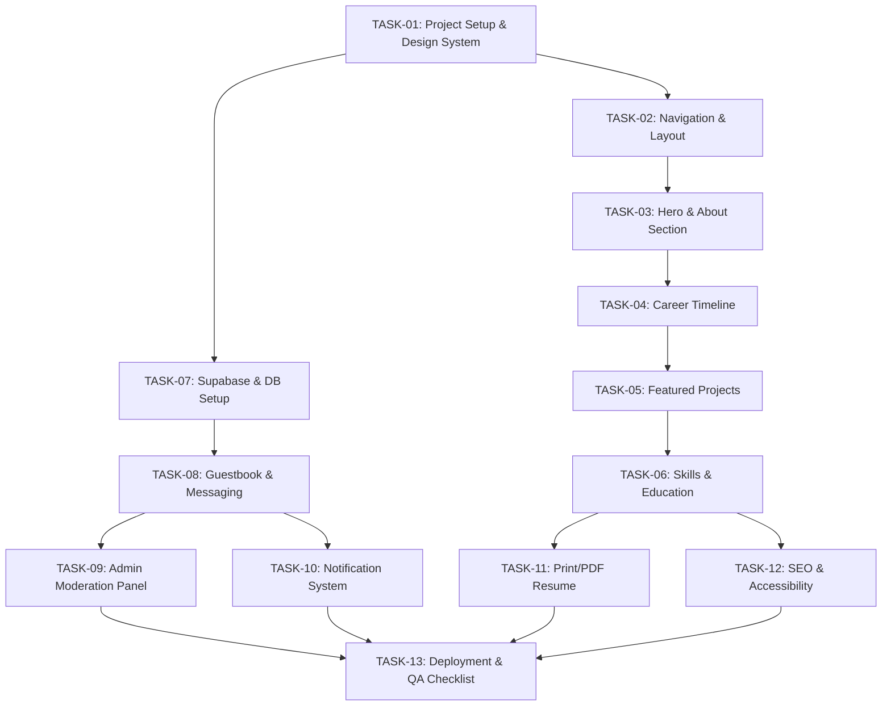

# 📋 Project Backlog Overview & Roadmap

> **Project**: Chaow Porkaew — Senior Software Developer / Tech Lead Modern Portfolio & CV  
> **Architecture**: Next.js (App Router) + TypeScript + Tailwind CSS + shadcn/ui + Supabase + Vercel  
> **Specification Reference**: [`CV_SPECIFICATION.md`](../CV_SPECIFICATION.md)

---

## 🎯 วัตถุประสงค์และการจัดการ Backlog

เอกสารชุดนี้จัดทำขึ้นเพื่อแบ่งการพัฒนาเว็บไซต์ออกเป็นชุดงานย่อย (Modular Backlogs) ที่ชัดเจน เพื่อให้สามารถ:
1. **ควบคุมทิศทางการพัฒนา**: มีแผนงานและ Acceptance Criteria ในแต่ละส่วนอย่างชัดเจน
2. **ตรวจสอบความถูกต้อง (Verification & QA)**: มีเกณฑ์การตรวจรับงานและขั้นตอนการทดสอบที่เป็นระบบ
3. **ติดตามสถานะ (Traceability)**: ตรวจสอบความคืบหน้าของแต่ละโมดูลได้ง่าย

---

## 🗺️ รายการ Backlog ทั้งหมด (All 13 Tasks Completed 🎉)

| Task ID | เอกสาร Backlog | คำอธิบายงาน | ระดับความสำคัญ | สถานะ |
| :--- | :--- | :--- | :---: | :---: |
| **TASK-01** | [`01-project-setup-and-design-system.md`](../4-done/01-project-setup-and-design-system.md) | โครงสร้างโปรเจกต์ Next.js, TypeScript, Tailwind CSS, shadcn/ui, Theme Provider | P0 (Must Have) | ✅ 4-done |
| **TASK-02** | [`02-navigation-and-layout.md`](../4-done/02-navigation-and-layout.md) | Header/Navbar, Mobile Drawer, Theme Toggle, Footer & Social Links | P0 (Must Have) | ✅ 4-done |
| **TASK-03** | [`03-hero-and-about-section.md`](../4-done/03-hero-and-about-section.md) | Hero Section, รูปโปรไฟล์, Headline, Quick Stats และ About Me / Core Values | P0 (Must Have) | ✅ 4-done |
| **TASK-04** | [`04-career-timeline-and-experience.md`](../4-done/04-career-timeline-and-experience.md) | Career Timeline (2011–ปัจจุบัน), 4 ช่วงการทำงาน, Key Achievements, Tech Badges | P0 (Must Have) | ✅ 4-done |
| **TASK-05** | [`05-featured-projects-and-architecture.md`](../4-done/05-featured-projects-and-architecture.md) | Featured Projects Showcase, สถาปัตยกรรมระบบ, Filter หมวดหมู่, Project Cards | P0 (Must Have) | ✅ 4-done |
| **TASK-06** | [`06-skills-matrix-and-education.md`](../4-done/06-skills-matrix-and-education.md) | Skills & Competencies Matrix 6 หมวดหมู่ และประวัติการศึกษา (มช. ป.โท/ป.ตรี) | P0 (Must Have) | ✅ 4-done |
| **TASK-07** | [`07-supabase-database-and-backend-setup.md`](../4-done/07-supabase-database-and-backend-setup.md) | ติดตั้ง Supabase, Table `guestbook_messages`, RLS Policies, Type Safety | P0 (Must Have) | ✅ 4-done |
| **TASK-08** | [`08-guestbook-and-messaging-feature.md`](../4-done/08-guestbook-and-messaging-feature.md) | ฟอร์ม Guestbook, Public/Private, Anti-spam (Turnstile), Wall of Love | P0 (Must Have) | ✅ 4-done |
| **TASK-09** | [`09-admin-moderation-panel.md`](../4-done/09-admin-moderation-panel.md) | แดชบอร์ด `/admin`, ระบบ Passcode Auth, Inbox (Pending/Approved/Private/Spam) | P1 (High) | ✅ 4-done |
| **TASK-10** | [`10-instant-notification-system.md`](../4-done/10-instant-notification-system.md) | ระบบแจ้งเตือนเจ้าของเว็บผ่าน Telegram Bot / Discord Webhook เมื่อมีข้อความใหม่ | P1 (High) | ✅ 4-done |
| **TASK-11** | [`11-print-ready-pdf-and-ats-resume.md`](../4-done/11-print-ready-pdf-and-ats-resume.md) | Layout สำหรับ Print/Export PDF และรูปแบบ ATS-friendly Resume | P1 (High) | ✅ 4-done |
| **TASK-12** | [`12-seo-metadata-and-accessibility.md`](../4-done/12-seo-metadata-and-accessibility.md) | Next.js Metadata API, OpenGraph Social Cards, SEO, a11y, Performance | P1 (High) | ✅ 4-done |
| **TASK-13** | [`13-deployment-and-qa-verification.md`](../4-done/13-deployment-and-qa-verification.md) | Vercel Deployment, Environment Variables, E2E Acceptance Testing Checklist | P0 (Must Have) | ✅ 4-done |

---

## 🔄 แผนผังลำดับการทำงาน (Dependency & Execution Flow)

